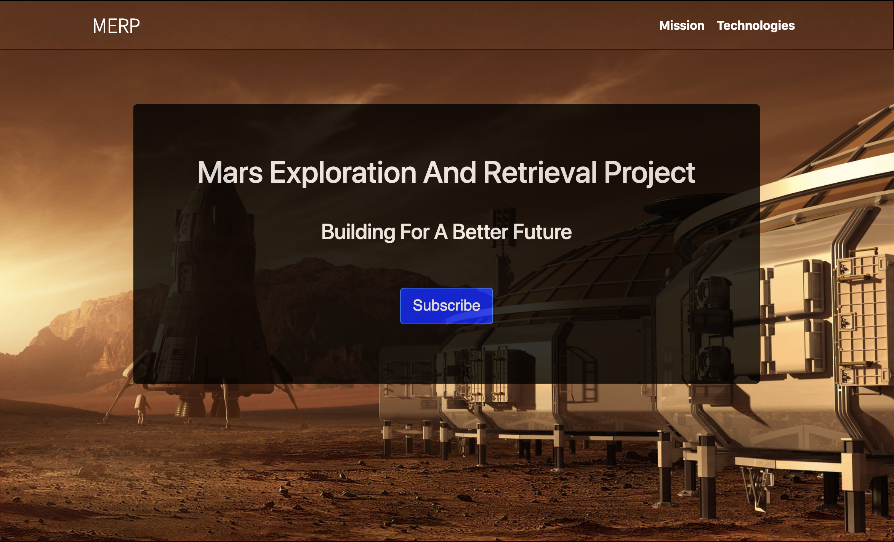
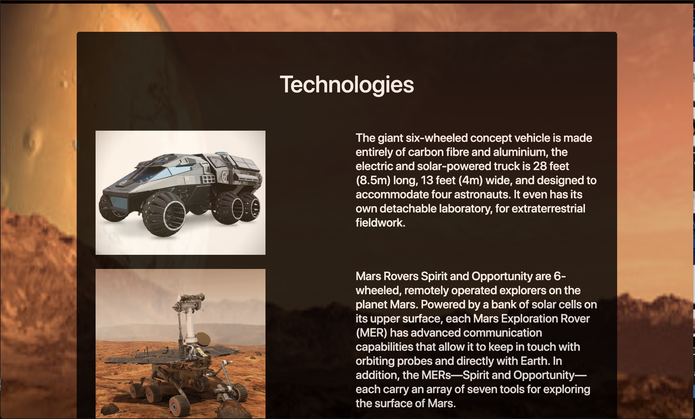

# MERP

This is a basic application using HTML and CSS with MailChimp API for subscription. Designed to show the progress of the Mars mission and to develop the planet into a habitable planet. 

Link to site: MERP

# Images

The first page is a app bar with subscribe part to get news on recent updates for the project. 

The rest of the site displays technologies used and explanation of the mission. 

# Technology Used
- HTML
- CSS

# Author 
[Muhammad Awais](https://mawais54013.github.io/New-Portfolio/)

[Github](https://github.com/mawais54013)